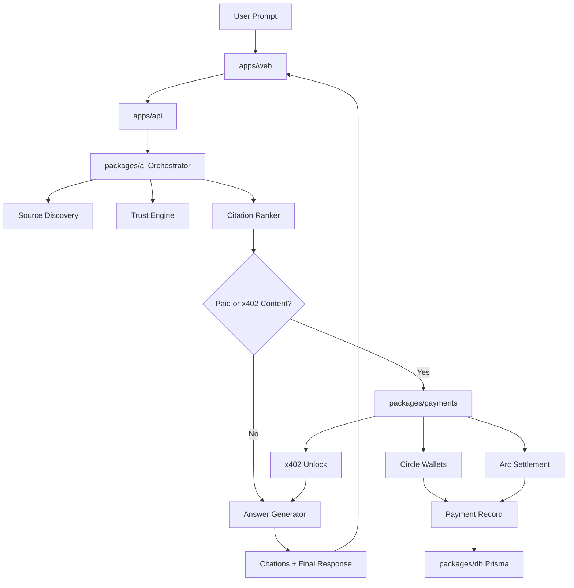

# Architecture Overview

CitePay uses a modular monorepo architecture with clear boundaries between product UI, API orchestration, AI agent logic, payment execution, persistence, and shared contracts.

## Applications

### apps/web

Next.js 15 App Router frontend responsible for:

- Landing page
- Query console
- Dashboard analytics
- Publisher monetization views
- Documentation surface
- Wallet and query state with Zustand
- API data fetching with React Query

### apps/api

Node.js Fastify backend responsible for:

- API gateway
- Agent orchestration
- Payment execution
- Query history
- Payment history
- Database integration boundary

## Packages

### packages/ai

Contains the core research agent:

- `source-discovery.ts`
- `trust-engine.ts`
- `citation-ranker.ts`
- `payment-detector.ts`
- `answer-generator.ts`
- `orchestrator.ts`

### packages/payments

Contains payment integrations:

- `circle.ts`
- `arc.ts`
- `x402.ts`
- `micropayments.ts`
- `wallet.ts`

Arc support includes JSON-RPC readiness checks, chain ID validation, USDC gas metadata, and Memo contract metadata for citation reconciliation.

### packages/db

Contains:

- Prisma schema
- Prisma client singleton
- Seed data

### packages/shared

Contains:

- Shared TypeScript interfaces
- Zod schemas
- Constants
